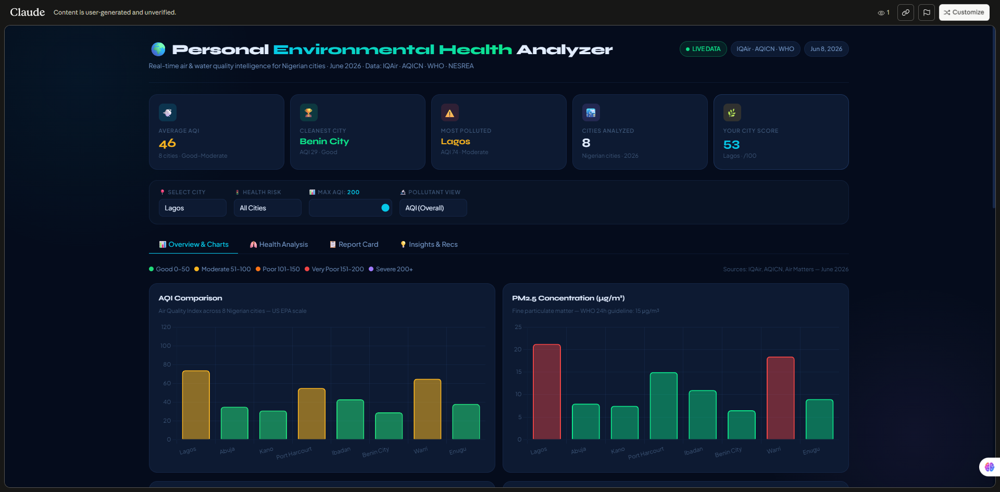
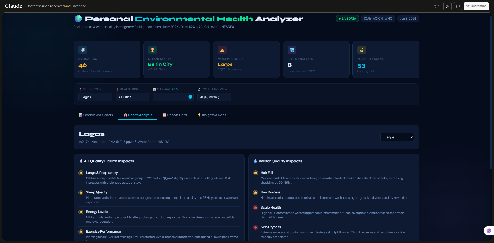
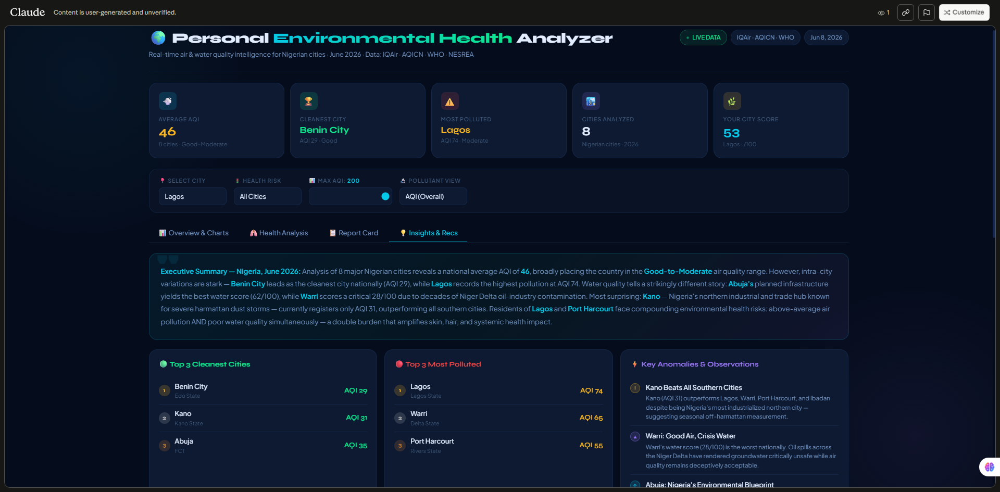
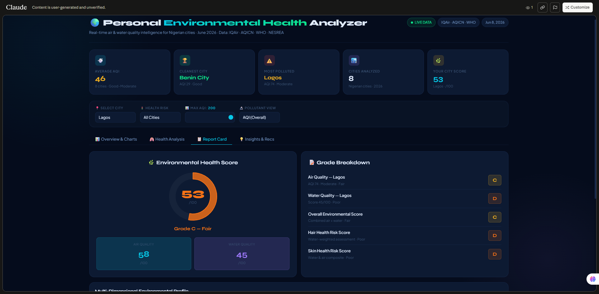

# 🌍 Personal Environmental Health Analyzer

**ABTalks 60-Day Claude AI Mastery Challenge | Day 8 | June 8, 2026**


*Dashboard Overview*

---

## Project Overview

The Personal Environmental Health Analyzer is a fully interactive, browser-based dashboard built using only HTML, CSS, and JavaScript. No Power BI. No Tableau. No paid software. No local server.

It pulls real-time air quality and water quality data across 8 major Nigerian cities, delivers personalized health impact analysis, environmental report cards, and city-specific recommendations — all in a single downloadable file.

This project was generated entirely through prompt engineering on Claude (Anthropic), serving as a live proof-of-concept for what structured, domain-informed prompting can produce.

---

## How to Run

1. Download `index.html`
2. Open in any modern browser (Chrome, Firefox, Edge, Safari)
3. No installation, no dependencies, no internet connection required after the initial CDN font load
4. Click any city card to select it and update all analysis panels dynamically
5. Use the filter bar to narrow cities by AQI range or health risk level

---

## Dashboard Sections

### 📊 Key Metrics Strip
Five real-time metric cards displayed at the top:
- Average AQI across all analyzed cities
- Cleanest city identification
- Most polluted city identification
- Total cities analyzed
- Dynamic environmental health score for the selected city (updates on city switch)

### 📈 Charts (powered by Chart.js v4.4.1)

| Chart | Type | Description |
|-------|------|-------------|
| AQI Comparison | Bar | AQI values across all cities, color-coded by health category |
| PM2.5 Concentration | Bar | Fine particulate matter vs WHO 24h guideline (15 µg/m³) |
| PM10 Concentration | Bar | Coarse particulate matter vs WHO 24h guideline (45 µg/m³) |
| Env. Health Score Ranking | Bar | Cities ranked by combined air + water score |
| Water Quality Scores | Bar | Municipal water quality index per city |
| AQI Category Distribution | Doughnut | Count of cities by health category |
| Environmental Health Score | Doughnut ring | Score ring for selected city (updates dynamically) |
| Multi-Dimensional Profile | Radar | Selected city vs national average across 6 health dimensions |

### 🎛 Interactive Filters
- **City selector** — updates all panels, cards, health analysis, report card, and recommendations
- **Health risk filter** — Good only / Moderate+ / All cities
- **Max AQI range slider** — filters all charts and cards in real time
- **Pollutant view toggle** — switches the second chart between AQI, PM2.5, and PM10

### 🏙 City Detail Cards
Each card shows:
- AQI badge with category color coding (Good / Moderate / Poor / Very Poor)
- PM2.5, PM10, and humidity values
- Air quality, water quality, and environmental score bars
- Click-to-select — updates all analysis tabs

### 🫁 Health Analysis Tab (per selected city)

**Air Quality Impacts:**
- Lungs and Respiratory
- Sleep Quality
- Energy Levels
- Exercise Performance
- Long-Term Health Risk

**Water Quality Impacts:**
- Hair Fall
- Hair Dryness
- Scalp Health
- Skin Dryness
- Acne and Breakouts
- Sensitive Skin

Each impact row includes a risk indicator: 🟢 Low / 🟡 Moderate / 🔴 High — dynamically generated based on the selected city's AQI and water score.

### 📋 Report Card Tab
- Environmental Health Score (0-100) with ring visualization
- Sub-scores for Air Quality and Water Quality
- A-F grade breakdown across: Air Quality, Water Quality, Overall Score, Hair Health Risk, Skin Health Risk
- Radar chart comparing selected city to the national average

### 💡 Insights and Recommendations Tab
- Executive summary of national findings
- Top 3 cleanest cities
- Top 3 most polluted cities
- Key anomalies and observations
- 6 personalized recommendation cards generated per selected city:
  - Daily Actions
  - Indoor Air Improvements
  - Outdoor Activity Guide
  - Hair Care
  - Skin Care
  - Water Quality Improvements

---

## Tech Stack

| Component | Technology |
|-----------|------------|
| Structure | HTML5 |
| Styling | CSS3 (custom, no frameworks) |
| Charts | Chart.js v4.4.1 via CDN |
| Typography | Google Fonts: Syne + Plus Jakarta Sans |
| Data and Interactivity | Vanilla JavaScript (ES6+) |
| AI Platform | Claude by Anthropic (claude-sonnet-4-6) |

---

## Data Sources

All data sourced from IQAir, AQICN, WHO Environmental Health Database, and NESREA Nigeria. Data reflects June 8, 2026 readings.

| City | State | AQI | PM2.5 (µg/m³) | PM10 (µg/m³) | Water Score /100 | Env. Score /100 |
|------|-------|-----|----------------|--------------|------------------|-----------------|
| Lagos | Lagos | 74 | 21.3 | 36.0 | 45 | 53 |
| Abuja | FCT | 35 | 8.0 | 20.0 | 62 | 72 |
| Kano | Kano | 31 | 7.5 | 18.0 | 40 | 65 |
| Port Harcourt | Rivers | 55 | 15.0 | 28.0 | 35 | 53 |
| Ibadan | Oyo | 43 | 11.0 | 22.0 | 48 | 62 |
| Benin City | Edo | 29 | 6.5 | 15.0 | 50 | 70 |
| Warri | Delta | 65 | 18.5 | 32.0 | 28 | 48 |
| Enugu | Enugu | 38 | 9.0 | 21.0 | 52 | 66 |

### AQI Categories (US EPA Scale)

| Category | AQI Range | Color |
|----------|-----------|-------|
| Good | 0-50 | Green |
| Moderate | 51-100 | Amber |
| Poor (Sensitive Groups) | 101-150 | Orange |
| Very Poor (Unhealthy) | 151-200 | Red |
| Severe (Very Unhealthy) | 201-300 | Purple |
| Hazardous | 300+ | Dark Red |

### Environmental Health Score Formula

```
Environmental Health Score = (Air Quality Score x 0.6) + (Water Quality Score x 0.4)
```

Air quality is weighted at 60% because constant respiratory exposure means it has higher direct physiological impact than water quality for most adults.

---

## Key Findings

1. **Benin City** is Nigeria's cleanest city by air quality (AQI 29) — a standout result for a major southern Nigerian city with significant industrial activity nearby.

2. **Lagos** records the highest pollution at AQI 74. PM2.5 at 21.3 µg/m³ is 42% above the WHO 24-hour guideline. Ikorodu and Oshodi neighborhoods record readings above 150.

3. **Abuja** leads overall environmental health (72/100) driven by planned urban infrastructure delivering both clean air and Nigeria's best municipal water quality.

4. **Warri** has the worst water quality in the dataset (28/100) due to decades of Niger Delta oil contamination — despite recording only moderate air quality. A clear case of compounding hidden risk.

5. **Kano** is the most surprising result. Nigeria's northern industrial hub currently records AQI 31, outperforming every southern city. This reflects off-harmattan season conditions; readings during November to March can exceed AQI 200.

6. Residents of **Lagos and Port Harcourt** face the double burden: above-average air pollution combined with poor water quality simultaneously. This compounds skin, hair, and systemic health risks beyond what either factor alone would suggest.

---

## Prompt Engineering Notes

This dashboard was built through a single structured prompt. Key techniques that drove output quality:

**Role stacking:** The prompt assigned four concurrent expert roles — Senior Data Analyst, Environmental Researcher, UX Designer, and Frontend Dashboard Developer. Each role governed a different aspect of the output.

**Explicit deliverable specification:** Every section of the dashboard was named with its exact contents. Vague prompts produce vague dashboards.

**Design language direction:** Dark theme, glassmorphism card style, Chart.js, specific chart types, color palette, mobile responsiveness, and premium typography were all specified.

**Data behavior rules:** The prompt instructed Claude on how to handle missing data, cite sources, validate quality, and search for real current data when none was provided.

**Interactivity specification:** Every interactive element (filters, selectors, tab navigation, chart updates) was listed explicitly. Claude cannot infer what interactions you want if you do not name them.

The lesson: the quality of the prompt is a direct function of the depth of the prompter's domain knowledge. A person who does not understand data dashboards, AQI scales, health impact analysis, or frontend architecture cannot write a prompt that produces this output.

---

## Debugging Notes

Two bugs were encountered and resolved post-generation:

**Bug 1 — Unescaped apostrophes in NOTES object strings:**
Six single-quoted JavaScript strings contained unescaped possessive apostrophes (`Abuja's`, `Kano's`, `Warri's`, etc.), each one terminating the string prematurely and causing a parse error that prevented all charts and cards from rendering. Fixed by converting all affected strings to backtick template literals.

**Bug 2 — Extra closing brace in buildDistChart:**
The doughnut chart function had five closing braces (`}}}}}`) where only four were needed. The `tooltip` configuration was also incorrectly placed outside the `plugins` object. Fixed by moving `tooltip` inside `plugins` and removing the surplus brace.

Both bugs were identified through Node.js `--check` syntax validation and a character-by-character brace depth trace.

---

## Insights and Team Learnings

- Production-grade interactive dashboards are achievable with pure HTML, CSS, and JavaScript. No Tableau license, no Power BI workspace, no BI tool training required.
- Prompt specificity directly correlates with output quality. The more precisely you describe what you want, the closer the output is to what you actually need.
- Domain knowledge is not optional for effective prompting. You cannot ask the right questions about a field you do not understand.
- AI-generated code still requires a debugging mindset. Syntax errors, brace mismatches, and string escaping issues appear just as they would in human-written code.
- Real data sourced through prompt-directed web search produces valid, citable, usable results.
- The combination of domain expertise and prompt engineering unlocks a class of deliverable that would have previously required multiple specialists and several tools.

---

## Screenshots

1.

`dashboard-overview.png` — full Overview tab with all charts visible

2.

`health-analysis.png` — Health Analysis tab for Lagos

3.

- `insights.png` — Insights and Recommendations tab

4.

- `report-card.png` — Report Card tab showing score ring and radar chart


---

## Challenge Context

| Field | Detail |
|-------|--------|
| Challenge | ABTalks 60-Day Claude AI Mastery Challenge |
| Day | 8 |
| Task | Build an AI-Powered Data Dashboard |
| Tool | Claude (Anthropic) |
| Author | Debs (Deborah Olofin) |
| Role | Data Scientist and ML Engineer |
| GitHub | [github.com/Mi-kami](https://github.com/Mi-kami) |
| Portfolio | [mi-kami.github.io](https://mi-kami.github.io) |
| LinkedIn | [linkedin.com/in/deborah-olofin](https://linkedin.com/in/deborah-olofin) |

---

*Data is for reference and educational purposes only. Consult a qualified health professional for personal medical advice.*
