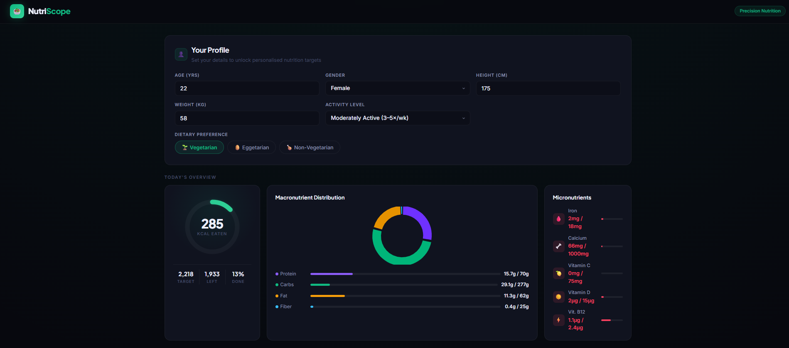

# 🥗 NutriScope → NutriScope Pro
### ABTalks 60-Day Claude AI Mastery Challenge · Day 9

[](https://github.com)
[](https://github.com)
[](https://claude.ai)
[](https://github.com)
[](https://github.com)
[](https://github.com)

---

## 📌 What Is This?

Two progressively built, fully functional **single-file HTML nutrition intelligence applications** built entirely through Claude AI prompting — no backend, no dependencies beyond CDN-loaded Chart.js, no build step.

**NutriScope (MVP)** is a precision nutrition tracker. **NutriScope Pro (Enhanced)** is a nutrition analyst and consultant: it tracks what you eat, tells you what you're missing, flags health risks, and recommends exactly which foods to add or swap.

Both applications are production-ready, mobile-responsive, and deployable by opening a single `.html` file in any browser.

---

## 📂 Files in This Repository

| File | Size | Description |
|------|------|-------------|
| `NutriScope.html` | ~48 KB | MVP — Day 9 initial build |
| `NutriScopePro.html` | ~92 KB | Enhanced — final deliverable |
| `DAY09_NutriScope_README_LinkedIn.md` | This file | Technical documentation + LinkedIn post |

---

## 🖼️ Screenshots

### MVP — NutriScope
```
📸 SCREENSHOT 1: Dashboard — Energy ring, macro doughnut, micro stats sidebar
    


📸 SCREENSHOT 2: Food Log — Search dropdown + food table with type badges
     [Replace with: screenshot showing a few foods logged]

📸 SCREENSHOT 3: Nutrient Table + Recommendations
     [Replace with: screenshot of full breakdown and recommendation cards]
```

### Enhanced — NutriScope Pro

```
📸 SCREENSHOT 4: Full Dashboard — Energy ring + macro chart + radar chart + bar chart
     [Replace with: screenshot of NutriScopePro.html dashboard with all 4 visualisations]

📸 SCREENSHOT 5: CSV Upload zone — drag-and-drop interface + format detection
     [Replace with: screenshot of the expanded CSV upload section]

📸 SCREENSHOT 6: 2-Day Meal Planner — both day columns with food entries
     [Replace with: screenshot of populated meal planner]

📸 SCREENSHOT 7: Risk Analysis — populated risk cards (High/Moderate/Low)
     [Replace with: screenshot of at least 4-5 risk cards showing different severity levels]

📸 SCREENSHOT 8: Full Nutrient Table — grouped rows (Macros/Minerals/Vitamins/Fats)
     [Replace with: screenshot of the 18-nutrient grouped table with status badges]
```

---

## ⚖️ MVP vs Enhanced — Feature Comparison

| Feature | NutriScope (MVP) | NutriScope Pro (Enhanced) |
|---------|-----------------|--------------------------|
| **Food Database** | 20 foods | 60 foods |
| **Nutrients Tracked** | 10 (5 macro + 5 micro) | 18 (5 macro + 11 micro + Omega-3) |
| **Micronutrients** | Iron, Calcium, Vit C, Vit D, B12 | + Zinc, Magnesium, Potassium, Folate, Vit A, Vit E, Phosphorus, Omega-3 |
| **Charts** | 1 (Macro doughnut) | 3 (Doughnut + Horizontal Bar + Radar) |
| **Navigation** | Scroll-only | Sticky subnav with IntersectionObserver highlighting |
| **CSV Upload** | ❌ | ✅ Dual-format auto-detection, fuzzy matching, DB extension |
| **Meal Planner** | ❌ | ✅ 2-day × 4 meals, calorie totals, Day 1 → Day 2 copy |
| **Risk Analysis** | ❌ | ✅ 11 health risk indicators (High/Moderate/Low) |
| **BMI Calculation** | ❌ | ✅ Real-time display + category badge |
| **Advanced Recommendations** | 6 basic reco types | 12 reco types + BMI-aware + food synergy + meal timing |
| **Nutrient Table Grouping** | Flat list | Grouped (Macros / Minerals / Vitamins / Essential Fats) |
| **Custom Food Import** | ❌ | ✅ CSV extends live food database, custom foods searchable |
| **Educational Disclaimer** | ❌ | ✅ Full disclaimer section |
| **Nutrition Sources** | ❌ | ✅ 6 cited sources |
| **File Size** | ~48 KB | ~92 KB |

---

## 🛠️ Technology Stack

| Layer | Technology | Notes |
|-------|-----------|-------|
| Structure | HTML5 (single file) | No build step, zero config |
| Styling | Pure CSS custom properties | Dark theme, CSS Grid, Flexbox |
| Charts | Chart.js 4.4.0 (CDN) | Doughnut, Horizontal Bar, Radar |
| Typography | Plus Jakarta Sans + Inter (Google Fonts) | Via CDN |
| Data | Inline JavaScript objects | USDA FoodData Central + ICMR-NIN values |
| Calculations | Mifflin-St Jeor BMR | Activity-adjusted TDEE |
| CSV Parsing | Custom RFC 4180-compliant parser | Handles quoted fields, mixed line endings |
| Persistence | None (session-only) | No backend, no localStorage |

---

## 🔬 Deep Dive: Enhanced Features

### 1. CSV Upload System (Data Scientist–Grade)

The CSV upload is built to handle real-world messy data — not just a toy file input.

**Parser handles:**
- RFC 4180-compliant quoted fields (`"food with, comma inside"`)
- Escaped double-quotes (`""`)
- Mixed line endings (`\r\n`, `\n`)
- Leading/trailing whitespace in fields

**Auto-detects two formats:**

**Format A — Food Log CSV** (for logging daily intake):
```csv
Food,Quantity,Unit
Rice,200,g
Dal,150,g
Egg,2,piece
Salmon,120,g
Spinach,100,g
```

**Format B — Nutrition Data CSV** (for extending the food database):
```csv
Name,Calories,Protein,Carbs,Fat,Fiber,Iron,Calcium,VitaminC,VitaminD,VitaminB12,Zinc,Magnesium,Potassium,Folate,VitaminA,VitaminE,Phosphorus,Omega3,Type
Protein Shake,120,25,5,2,0,0,300,0,0,1.5,0,30,150,0,0,0,200,0,veg
Custom Dal,110,8.5,19,0.5,7.5,3,18,1.2,0,0,1.2,34,350,175,1,0.1,175,0.06,veg
```

**Fuzzy food name matching:**
```
"rice"         → "Rice"      (exact, case-insensitive)
"brown rice"   → "Brown Rice" (exact)
"chick"        → "Chicken"   (partial)
"moong"        → "Moong Dal" (substring)
```

**Nutrition Data CSV behaviour:**
- Unrecognised foods → added to live `FDB` object
- Now searchable from the food log search
- Displayed with a `CSV` badge in the food table
- Persist for the entire browser session

**Template downloads** generate properly structured starter CSVs users can open in Excel, Numbers, or Google Sheets.

---

### 2. Food Database — 60 Foods, 18 Nutrients

All values are per 100g from USDA FoodData Central and ICMR-NIN Food Composition Tables.

**New foods added in Enhanced version (40):**

| Category | Foods |
|----------|-------|
| Grains | Brown Rice, Quinoa, Bajra, Jowar, Besan, Brown Bread |
| Vegetables | Sweet Potato, Corn, Tomato, Carrot, Cauliflower, Broccoli, Cucumber, Onion, Beetroot, Pumpkin |
| Legumes | Moong Dal, Masoor Dal, Peas, Soya Chunks, Tofu |
| Nuts & Seeds | Peanuts, Almonds, Walnuts, Cashews, Flaxseeds, Chia Seeds, Pumpkin Seeds |
| Fruits | Orange, Mango, Watermelon, Papaya, Lemon |
| Proteins | Mutton, Prawns, Tuna, Salmon, Greek Yogurt, Ghee, Coconut Milk |

**Nutrients tracked per food (18 fields):**

| Code | Nutrient | Unit | RDA Source |
|------|---------|------|-----------|
| `c` | Calories | kcal | Mifflin-St Jeor TDEE |
| `p` | Protein | g | 0.9–1.4g/kg body weight |
| `cb` | Carbohydrates | g | 50% of TDEE |
| `f` | Fat | g | 25% of TDEE |
| `fi` | Fiber | g | 25–38g (ICMR-NIN) |
| `ir` | Iron | mg | 8mg M / 18mg F (NIH ODS) |
| `ca` | Calcium | mg | 1000mg (NIH ODS) |
| `zn` | Zinc | mg | 11mg M / 8mg F |
| `mg` | Magnesium | mg | 400mg M / 310mg F |
| `k` | Potassium | mg | 3400mg M / 2600mg F |
| `ph` | Phosphorus | mg | 700mg |
| `vc` | Vitamin C | mg | 90mg M / 75mg F |
| `vd` | Vitamin D | µg | 15µg (600 IU) |
| `vb` | Vitamin B12 | µg | 2.4µg |
| `fo` | Folate (B9) | µg | 400µg / 600µg (fertile-age women) |
| `va` | Vitamin A | µg RAE | 900µg M / 700µg F |
| `ve` | Vitamin E | mg | 15mg |
| `o3` | Omega-3 | g | 1.6g M / 1.1g F (AI) |

---

### 3. Health Risk Analysis (11 Indicators)

The risk engine evaluates the current food log against personalised targets and returns risk cards at three severity levels.

| # | Risk | Trigger Condition | Max Severity |
|---|------|-----------------|-------------|
| 1 | Iron Deficiency / Anemia | Iron < 50% of target | HIGH |
| 2 | Bone Health Risk | Calcium < 55% AND Vit D < 50% | HIGH |
| 3 | Vitamin B12 Deficiency | B12 < 40% (vegetarians/eggetarians) | HIGH |
| 4 | Cardiovascular Health | Fat > 140% AND Omega-3 < 30% | HIGH |
| 5 | Immune Function | Vit C < 40% AND Zinc < 50% | LOW |
| 6 | Caloric Excess | Calories > 130% of TDEE | HIGH (with elevated BMI) |
| 7 | Insufficient Calories | Calories < 50% (≥3 foods logged) | MODERATE |
| 8 | Muscle Preservation | Protein < 65% with activity ≥ 1.55 | HIGH |
| 9 | Folate Deficiency | Folate < 50% (elevated for fertile-age women) | HIGH |
| 10 | Vitamin A Deficiency | Vit A < 40% | LOW |
| 11 | Low Dietary Fibre | Fibre < 45% | LOW |

Each risk card includes: severity badge, clinical description, and a specific food-based action with example nutrient densities.

---

### 4. Two-Day Meal Planner

- 4 meal slots per day: Breakfast 🌅, Lunch ☀️, Snack 🍎, Dinner 🌙
- Per-slot calorie totals update in real-time
- Per-day macros summary (P / C / F)
- Daily calorie total vs TDEE target (% shown)
- One-click "Copy Day 1 → Day 2" — deep-copies all entries with new IDs
- Same fuzzy search and unit conversion as the food log
- Planner state is separate from the food log

---

### 5. Chart System

| Chart | Type | Purpose |
|-------|------|---------|
| Macro Doughnut | Chart.js Doughnut | Live gram distribution: Protein / Carbs / Fat / Fiber |
| Macro & Calorie Progress | Chart.js Horizontal Bar | % of daily target for 6 key nutrients. Colors: amber (<75%), green (75–120%), red (>120%) |
| Micronutrient Radar | Chart.js Radar | 8-axis spider: Iron, Calcium, Zinc, Vit C, Vit D, B12, Folate, Vit A vs 100% target ring |

All three charts destroy and recreate cleanly when profile changes, and use `update('none')` for in-session changes to avoid animation jank.

---

## 📊 Nutrition Data Sources

| Source | Used For |
|--------|---------|
| [USDA FoodData Central](https://fdc.nal.usda.gov) | Primary nutritional composition values |
| [ICMR-NIN Food Composition Tables](https://www.nin.res.in) | Indian food-specific values (Rice, Roti, Dal, Poha, etc.) |
| [ICMR Dietary Guidelines for Indians 2024](https://www.icmr.gov.in) | Macro ratios and fibre recommendations |
| [NIH Office of Dietary Supplements](https://ods.od.nih.gov) | RDA/AI values for all vitamins and minerals |
| [WHO/FAO Expert Consultations](https://www.who.int) | Protein and Omega-3 reference standards |
| Mifflin-St Jeor (AJCN, 1990) | BMR formula for TDEE calculation |

---

## 🚀 How to Use

```bash
# No installation needed. Just open in a browser.

# Option 1 — Double-click
Open NutriScopePro.html in Chrome, Firefox, or Edge

# Option 2 — Local server (avoids any CORS issues with fonts)
python -m http.server 8000
# Then open http://localhost:8000/NutriScopePro.html

# Option 3 — Deploy to any static host
# Netlify Drop, GitHub Pages, Vercel, or Cloudflare Pages
# Drop the .html file → get a live URL
```

**To test CSV upload:**
1. Click "CSV Upload" to expand the section
2. Download the "Food Log CSV" template
3. Open in Excel/Google Sheets, fill in your foods, save
4. Drag-and-drop the file back, or click to browse
5. The app fuzzy-matches names and logs them automatically

---

## 💡 Key Learnings

### Technical

1. **Single-file architecture scales surprisingly well.** A 92 KB HTML file with 60 foods, 18 nutrients, 3 charts, a meal planner, risk analysis, and a CSV parser is still fast, deployable without infrastructure, and shareable as an attachment.

2. **RFC 4180 CSV parsing is non-trivial.** Real-world CSVs have quoted fields with commas inside, escaped quotes, mixed `\r\n`/`\n` line endings, and leading/trailing whitespace. The naive `row.split(',')` approach breaks immediately. A character-by-character parser handles all of these correctly.

3. **Fuzzy matching significantly improves CSV usability.** Users write "rice" not "Rice", "brown rice" not "Brown Rice". Case-insensitive exact → partial → substring fallback catches most real-world variations without requiring a heavy fuzzy library.

4. **Chart.js instance management is critical in a single-file app.** Storing chart instances in module-scoped variables and calling `.destroy()` before recreating (or `.update()` for data-only changes) prevents canvas context leaks and double-render bugs.

5. **IntersectionObserver is the right tool for sticky nav highlighting.** `scroll` event listeners with `getBoundingClientRect` calculations work but are expensive. A single `IntersectionObserver` with `threshold: 0.25` and appropriate `rootMargin` handles it cleanly without performance cost.

6. **Database extension from CSV requires re-referencing food objects.** When you add a custom food to `FDB` during a session, all existing search functions and totals calculations pick it up automatically because they iterate `Object.keys(FDB)` dynamically, not a cached array.

### Prompting

7. **Specificity in prompts produces architectural decisions, not just code.** Describing the CSV parser requirements (RFC 4180, fuzzy matching, format auto-detection, DB extension) resulted in a complete, edge-case-aware implementation rather than a basic file reader.

8. **Iterative enhancement works when context is preserved.** Building MVP first, then providing the full feature list for the enhanced version with clear context about what exists, produces coherent additions rather than a rewrite.

9. **Domain knowledge in prompts elevates output quality.** Including specific nutrient names, RDA sources, clinical risk thresholds, and food composition values (rather than asking Claude to "add nutrition data") produced medically grounded content rather than generic approximations.

---

## 👩🏾‍💻 About

**Built by Deborah Olofin (Debs)**
Data Scientist & ML Engineer · Lagos, Nigeria
[GitHub: Mi-kami](https://github.com/Mi-kami) · [Portfolio: mi-kami.github.io](https://mi-kami.github.io)

**Challenge:** ABTalks 60-Day Claude AI Mastery Challenge
**Day:** 9 of 60 · Completed: June 2026
**Model used:** Claude Sonnet (claude.ai)

---


```
